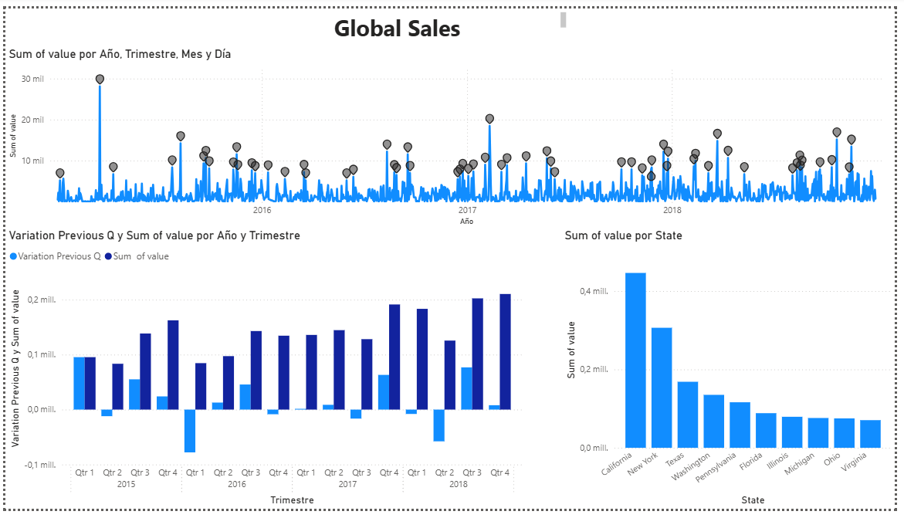
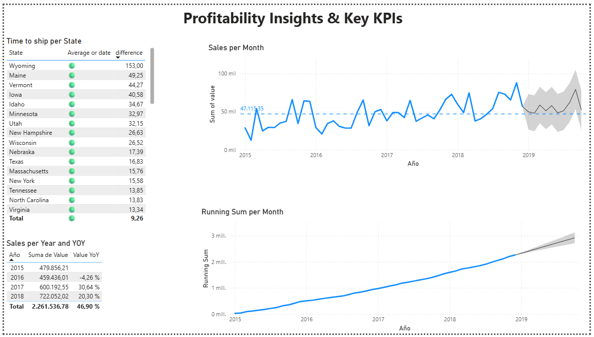

# Sales & Revenue Intelligence Dashboard

## 📊 Project Overview
This project demonstrates a comprehensive Business Intelligence solution designed to analyze sales performance across multiple regions and product categories. The goal was to transform raw transactional data into an interactive dashboard that supports strategic decision-making.

## 📊 Dashboard Previews

### 1. Global Sales Performance
*Visualizing revenue trends across states and quarterly variances.*

### 2. Profitability & Forecasting
*AI-powered forecasting (grey area) and Year-over-Year growth analysis with conditional formatting.*

## 🛠️ Tech Stack & Approach
* **Visualization:** Microsoft Power BI (Interactive Reports, Bookmarks, Drill-downs).
* **Data Modelling:** Power Query (M Language) & DAX (Data Analysis Expressions).
* **Scalability Layer:** Python (Pandas/NumPy) - *Included as a scalable ETL alternative.*

## 📂 Repository Contents
* `Sales_Report_Final.pbix`: The compiled Power BI report file.
* `etl_scalability_script.py`: A Python script demonstrating how to process this dataset programmatically (clean, transform, and normalize) outside of Power BI to handle larger volumes (Big Data scenarios).
* `data_sample.csv`: Anonymized dataset used for this analysis.

## 💡 Key Features Implemented
1.  **Advanced DAX Calculations:**
    * Time Intelligence (YoY Growth %, YTD Revenue).
    * Dynamic Ranking measures (Top N Products).
2.  **Hybrid ETL Strategy:**
    * **Standard approach:** Used Power Query for rapid development and maintenance.
    * **Enterprise approach:** Included a Python script to demonstrate capability for pre-processing high-volume data (1M+ rows) before ingestion, optimizing report performance.
3.  **UX/UI Design:**
    * Navigation buttons and bookmarks for a seamless app-like experience.
    * Conditional formatting to highlight underperforming KPIs.

## 📈 Business Impact
* Reduced manual reporting time by **95%**.
* Enabled granular analysis of profit margins per SKU, identifying critical areas for cost reduction.

## 🚀 How to Use
1.  Download the `Sales_Report_Final.pbix` file.
2.  Open with Power BI Desktop.
3.  (Optional) Run `etl_scalability_script.py` to see the automated cleaning process in the terminal.

---
*Created by [Your Name] - Data Analyst & Automation Specialist*
